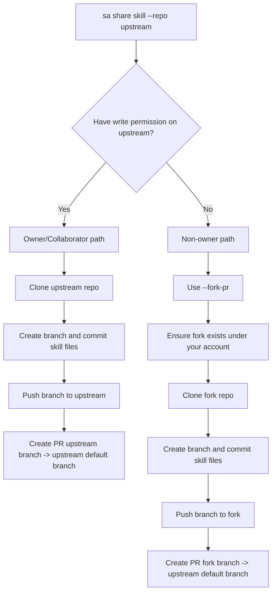
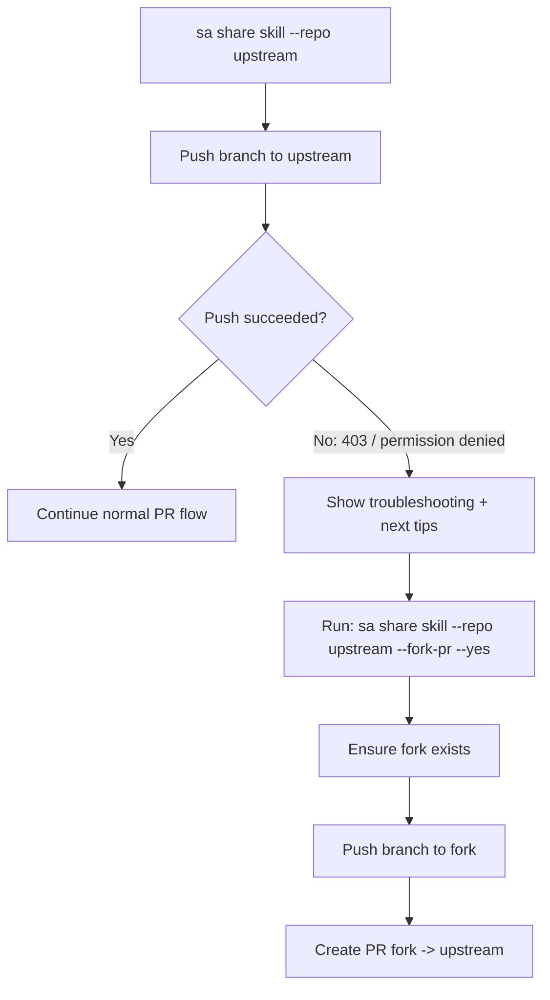

# sa share - Create PR For Local Skill

## Quick Start

Most users only need one command:

```bash
sa share <skill>
```

Example:

```bash
sa share qa-only
```

## Overview

`sa share` creates a branch and Pull Request for a local skill.

- Input direction: local -> repository (PR)
- It does **not** auto-merge.
- Auto PR creation needs GitHub CLI `gh`.

## GitHub CLI Setup

After `npm install`, the project will check whether `gh` exists.

- Install `gh`: `npm run setup:gh`
- Login once: `gh auth login`
- Auto-install is enabled by default during `npm install`
- Disable auto-install:
  - PowerShell: `$env:SA_AUTO_INSTALL_GH='0'; npm install`
  - bash/zsh: `SA_AUTO_INSTALL_GH=0 npm install`

## Advanced Options

| Option | Description | Default |
|---|---|---|
| `--repo <url>` | Target git repository URL | `https://github.com/leow3lab/awesome-ascend-skills` |
| `--branch <name>` | Branch name | `skill/<name>-v<version>` |
| `--fork-pr` | Push to your fork and create PR to upstream | `false` |
| `--gh <path>` | GitHub CLI path | `gh` |
| `--yes` | Skip security confirmation | `false` |

## Owner / Non-owner Scenarios

## Flow Diagram





### Scenario A: Repository Owner (or collaborator with write permission)

Expected behavior:
1. Branch is created and pushed
2. PR is created automatically (when `gh` authenticated)

Run:

```bash
sa share qa-only --repo https://github.com/leow3lab/awesome-ascend-skills --yes
```

### Scenario B: Non-owner (no write permission)

Expected behavior:
1. Push/PR fails
2. CLI prints troubleshooting guidance and next tips for fork PR

For non-owner PR flow, use fork mode:

```bash
sa share qa-only --repo https://github.com/yuanhechen/OpenMemory --fork-pr --yes
```

Typical guidance includes:
- `gh auth status`
- write permission check
- remote branch verification command

## Test Script

Use `tests/test-share-pr.js` for scenario-based testing.

You can also include it in the global test runner:

```bash
npm run test:all
# or:
RUN_SHARE_PR_TESTS=1 npm test
```

### 1) Owner real-repo test

```bash
node tests/test-share-pr.js --scenario owner --repo https://github.com/leow3lab/awesome-ascend-skills --skill qa-only
```

### 2) Non-owner fork-pr success test

```bash
node tests/test-share-pr.js --scenario fork-pr --repo https://github.com/yuanhechen/OpenMemory --skill qa-only
```

## Related Commands

- `sa export <skill>`: export package to local file
- `sa import [source]`: discover/import skills

